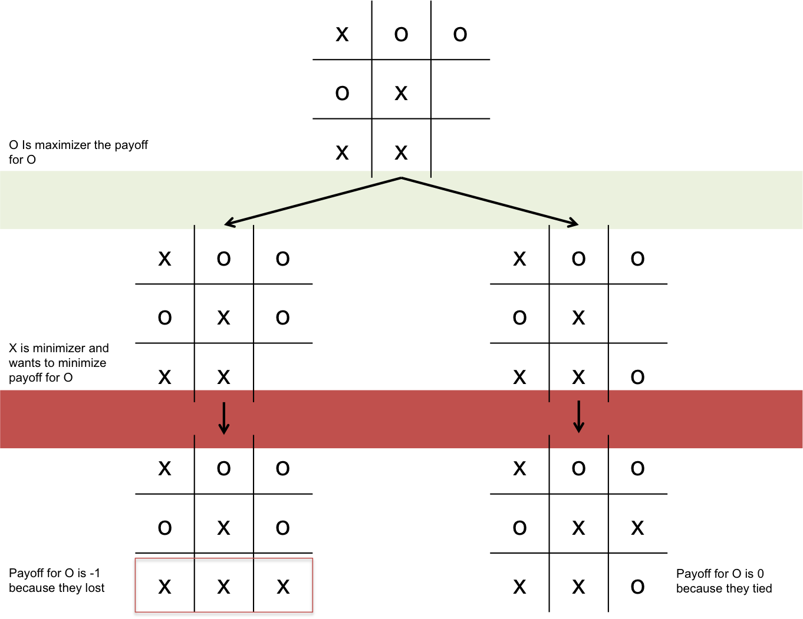
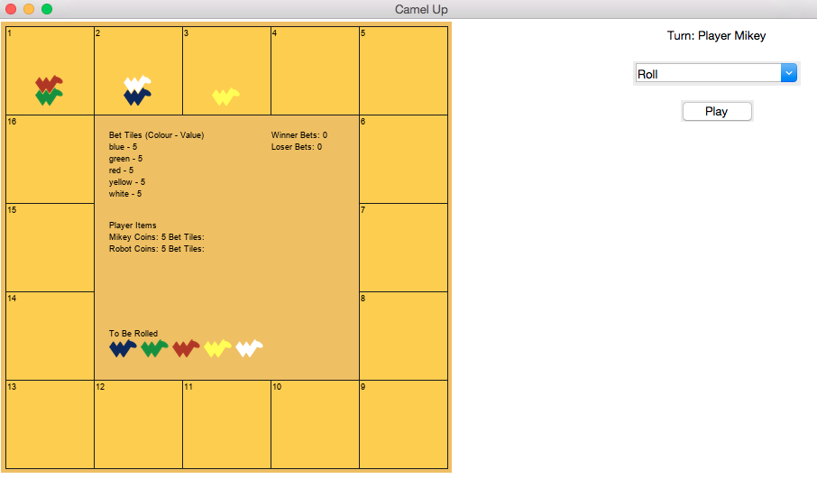

# How not to lose at tic tac toe

Michael Gracie

October 2018

---
## Have you ever lost?

<div class="image12">
    <div style="float:left;margin-right:5px;">
        
    </div>
    <div style="float:left;margin-right:5px;">
        
</div>

---

## Apply game theory to beat your friends at games


Lets use **tic tac toe** as an example

---

## Basics of concepts of a game

- *Agent* - The people making decisions within a game
- *State* - Information about who's decision it is within the game
- *Payoff* - The reward the agent receives for winning the game

---

## Minimax Algorithm

Minimax is an algorithm that you can apply to two player *zero-sum* games with *perfect information*. Within the game you have


<div class="image12">
    <div style="float:left;margin-right:5px;">
        
    <p style="text-align:center;">Maximizer</p>
    </div>
    <div style="float:left;margin-right:5px;">
        
    <p style="text-align:center;">Minimizer</p>
</div>


The maximizer is assumed to make optimal moves to maximizer their payoff. The minimizer is assumed to make optimal moves to minimize the payoff of the maximizer.

---

## Implementation looks like this





---

## In pseudo-code

```python
def minimax(game, maximizingPlayer):
    if game.done:
        return payoff
    if maximizingPlayer:
        value = −∞
        for move in game:
            value = max(value, minimax(move(game), FALSE))
        return value
    else:
        value = +∞
        for move in game:
            value = min(value, minimax(move(game), True))
        return value
```

---

## Alpha Beta Pruning

>  Implementation that stops searching a branch when a worse payoff is guaranteed


---

## What else is there

- **Expectiminimax** - `Minimax` with chance included
- **Multi Agent Utilit** - A game where we assume each agent wants to maximize their payoff
- **Monte Carlo Tree Search** - Algorithim specializing in complex trees

---

## Camelup

> This is the game I modelled to beat my friends in




`https://github.com/michael-gracie/camelup`
